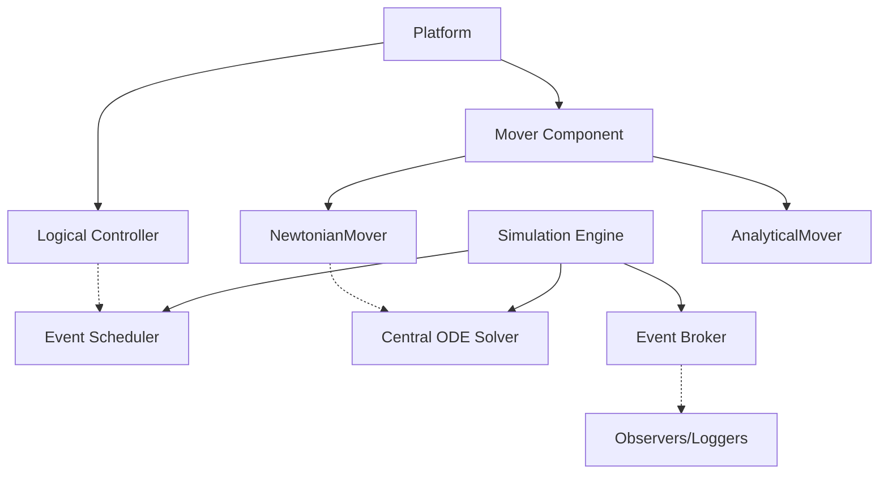
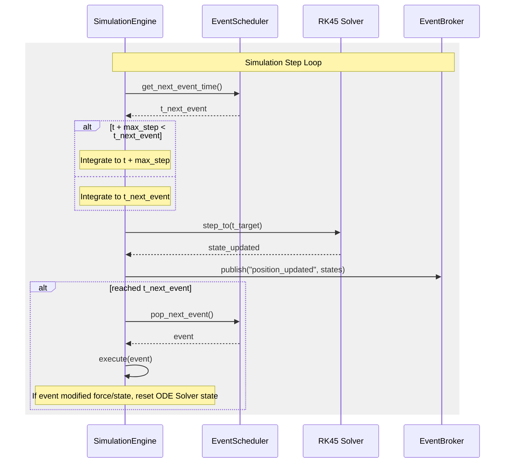
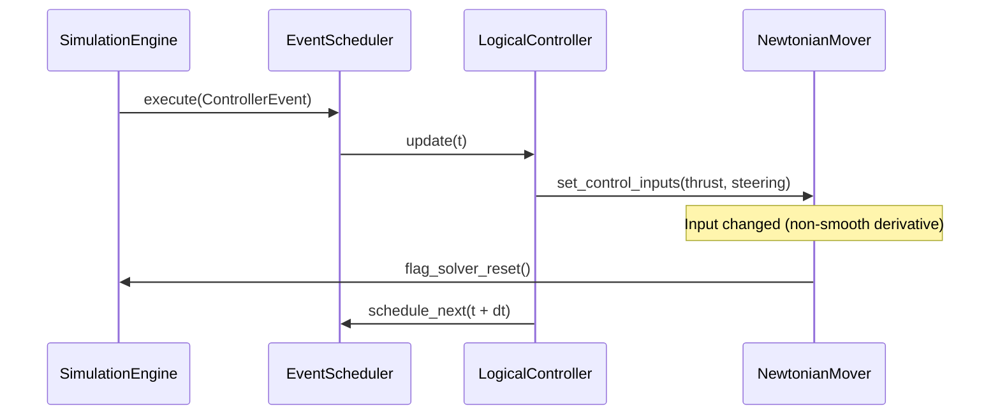

# Mover Simulation Design Specification

This document details the high-level design, class structure, and data flows for the general-purpose moving platforms simulator.

---

## 1. System Architecture

The simulation uses a hybrid **event-driven and step-based** architecture, managing both continuous physics state integration (via SciPy's `RK45` solver) and discrete system events.



---

## 2. Core Modules and Class Structure

### 2.1 Core Package (`mover_sim.core`)

#### `SimulationEngine`
Coordinates the simulation loop, advances time, manages the ODE solver, and handles events.
*   **Key Responsibilities**:
    *   Maintain current simulation time $t$.
    *   Dynamically assemble state vector $Y$ and derivative function $F(t, Y)$ from active `NewtonianMover` instances.
    *   Integrate continuous state using `scipy.integrate.RK45` up to the next scheduled event time.
    *   Execute events at their scheduled times and handle state/solver resets when force or state updates are non-smooth.
    *   Dispatch simulation lifecycle events to the central `EventBroker`.

#### `EventScheduler`
Maintains a priority queue of scheduled events sorted by time.
*   **Key Responsibilities**:
    *   Insert, retrieve, and cancel events.
    *   Support both user-defined events (one-time or recurring) and internal solver boundary events.

#### `EventBroker`
A Publish-Subscribe broker that decouples platforms, solvers, and observers.
*   **Key Responsibilities**:
    *   Allow observers to subscribe to specific topics (e.g., `"position_update"`, `"collision"`, `"spawn"`).
    *   Provide a `publish(topic, data)` method for sending telemetry and event payloads.

#### `Platform`
Represent a physical entity in the simulation.
*   **Attributes**:
    *   `id`: Unique identifier string.
    *   `mover`: Reference to a `Mover` object.
    *   `controller`: Reference to an optional `Controller` object.
    *   `properties`: Key-value store for physical characteristics (e.g., mass, wing area).

#### `Mover` (Base Class)
Abstract base class defining how a platform updates its position/state.
*   **Subclasses**:
    *   `AnalyticalMover`: Bypasses the ODE solver, calculating state analytically: $x(t) = f(t)$.
    *   `NewtonianMover`: Registers a slice of the global ODE state vector and provides derivatives $\dot{y} = f(t, y, \text{forces})$.

#### `Controller` (Base Class)
Base class for logical control loops (guidance, path following, autopilots).
*   **Key Responsibilities**:
    *   Registers recurring update events at a target frequency (e.g., 50 Hz).
    *   During execution, reads platform state, computes guidance commands (e.g., target thrust, steering angle), and applies them as forces or control variables to the `Mover`.

---

### 2.2 Math & Physics Layer (`mover_sim.math`)

#### `CoordinateTransforms`
Utility class for conversions using the WGS-84 ellipsoidal model:
*   `ecef_to_lla(x, y, z) -> (lat, lon, alt)`
*   `lla_to_ecef(lat, lon, alt) -> (x, y, z)`
*   `ecef_to_enu(x, y, z, lat_ref, lon_ref, alt_ref) -> (e, n, u)`
*   `enu_to_ecef(e, n, u, lat_ref, lon_ref, alt_ref) -> (x, y, z)`

#### `GlobalPhysics`
Calculates environmental accelerations/forces in ECEF/ECI coordinates:
*   `gravity(ecef_pos) -> gravity_accel`
*   `coriolis(velocity) -> coriolis_accel`
*   `aerodynamic_drag(velocity, air_density, cd, area) -> drag_force`

---

## 3. Key Workflows & Execution Sequences

### 3.1 Main Simulation Step



### 3.2 Event-Scheduled Controller Execution



---

## 4. Proposed Package Structure

```text
mover_sim/
│
├── mover_sim/
│   ├── __init__.py
│   ├── core/
│   │   ├── __init__.py
│   │   ├── engine.py          # SimulationEngine & EventScheduler
│   │   ├── broker.py          # EventBroker (Pub/Sub)
│   │   ├── platform.py        # Platform base class
│   │   ├── mover.py           # Mover (Analytical, Newtonian)
│   │   └── controller.py      # Logical controller base
│   │
│   ├── math/
│   │   ├── __init__.py
│   │   ├── coordinates.py     # Coordinate transforms (WGS-84, ENU, ECEF)
│   │   └── physics.py         # Global force models (Gravity, Coriolis, Drag)
│   │
│   └── models/
│       ├── __init__.py
│       ├── spline_mover.py    # Waypoint & spline followers
│       └── aircraft_mover.py  # Aircraft model (forces: thrust, lift, drag)
│
└── tests/                     # Unit test suite
    ├── __init__.py
    ├── test_coordinates.py
    ├── test_engine.py
    └── test_movers.py
```